  

&nbsp;

&nbsp;

&nbsp;

---

## About Me

My work spans end-to-end: from designing **LLM-powered autonomous agents** and **MCP-based toolchains** to provisioning production-grade infrastructure with **Terraform** and automating complex workflows with **n8n**. I build systems that are reliable, observable, and built to scale.

- Designing and deploying **multi-agent AI systems** using frameworks like LangGraph, CrewAI, and AutoGen
- Building **Model Context Protocol (MCP)** servers to extend LLM capabilities with structured tool access
- Automating business workflows end-to-end with **n8n** and Apache Airflow
- Provisioning and managing cloud infrastructure declaratively with **Terraform**

---

## Tech Stack

### Languages

### AI / ML & Data Science

### Agentic AI & Automation

### Web Development

### Cloud & DevOps

### Databases & Tools

---

## Contribution Activity

<picture>
  <source
    media="(prefers-color-scheme: dark)"
    srcset="https://raw.githubusercontent.com/4ymaneBH/4ymaneBH/output/github-contribution-grid-snake-dark.svg"
  />
  <source
    media="(prefers-color-scheme: light)"
    srcset="https://raw.githubusercontent.com/4ymaneBH/4ymaneBH/output/github-contribution-grid-snake.svg"
  />
  
</picture>

---

### Let's connect

&nbsp;

&nbsp;

